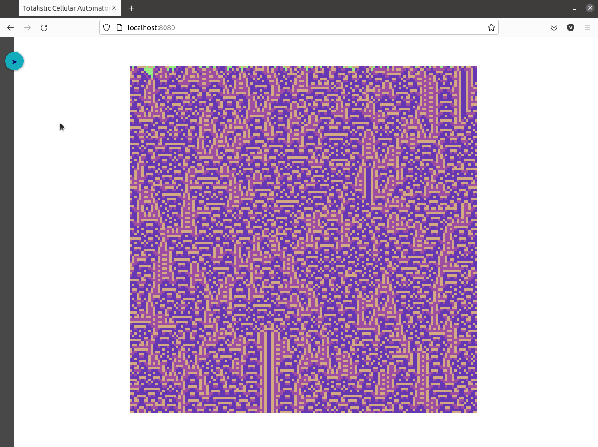

A Javascript tool to create [totalistic cellular automata](https://mathworld.wolfram.com/TotalisticCellularAutomaton.html).

## Demo

<p align="center">
  
</p>

## How to run locally

First, install the npm dependencies:

```bash
npm install
```

Then, run the server:

```bash
npm run start
```

And finally, visit http://localhost:8080 to launch the tool.

## Cellular Automaton Parameters

Each automaton is defined by the following parameters:

* `colors`: The number of colours (allowed: 2-10; default: 4).

* `cellSize`: The size of each cell in pixels (allowed: 1-20; default: 5).

* `rows`: The number of rows (allowed: 10-1000; default: 150).

* `columns`: The number of columns (allowed: 10-1000; default: 150).

* `table`: It specifies the state a given cell will have in the next generation based on the sum value of the three cells consisting of the cell to its left, the value the cell itself, and the value of the cell to its right. If this parameter isn't present or its format is wrong, it'll be generated randomly.

* `palette`: Automaton's list of colours. If this parameter isn't present or its format is wrong, it'll be generated randomly.

* `firstRow`: Automaton's initial state. It corresponds to the states of the cells for the grid's first row (top row). If this parameter isn't present or its format is wrong, it'll be generated randomly.

The parameters can be provided as URL search parameters or through the sidebar form.

## License

This code is licensed under MIT license.
